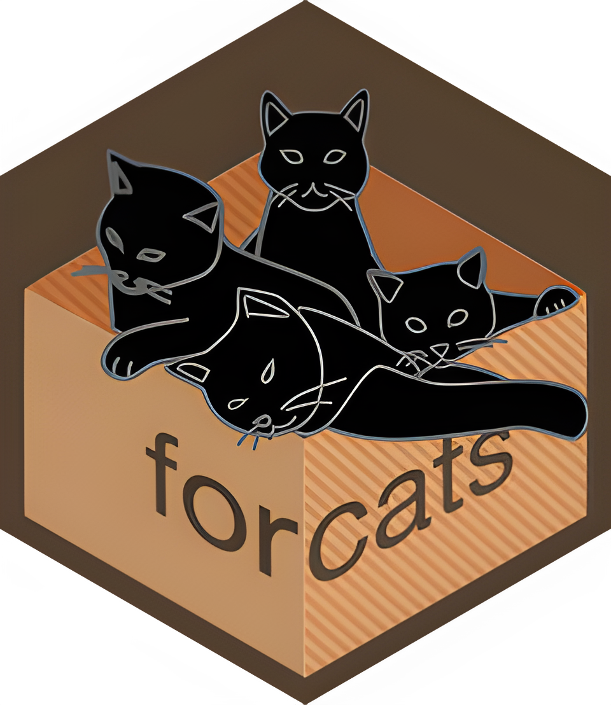
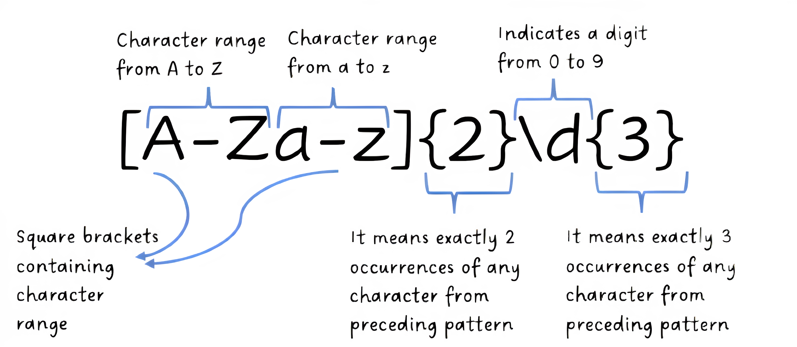
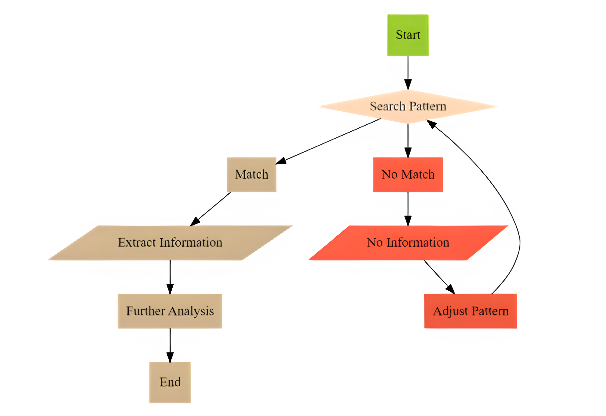
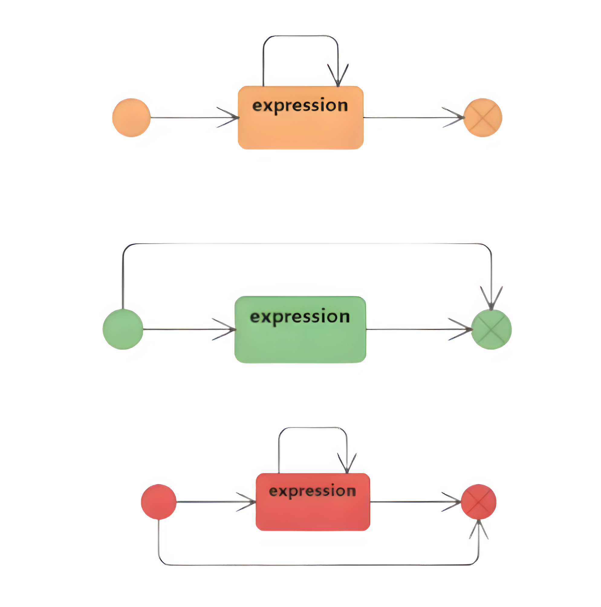
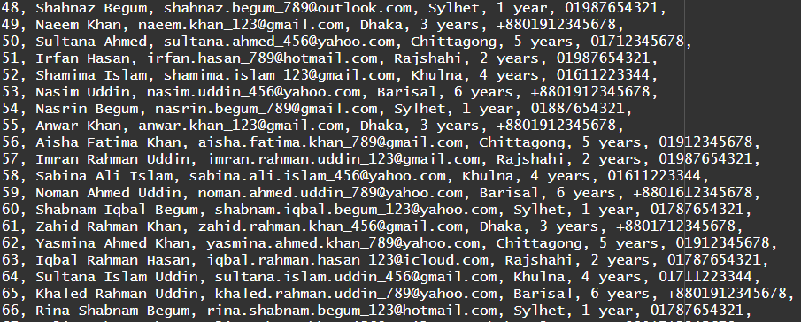
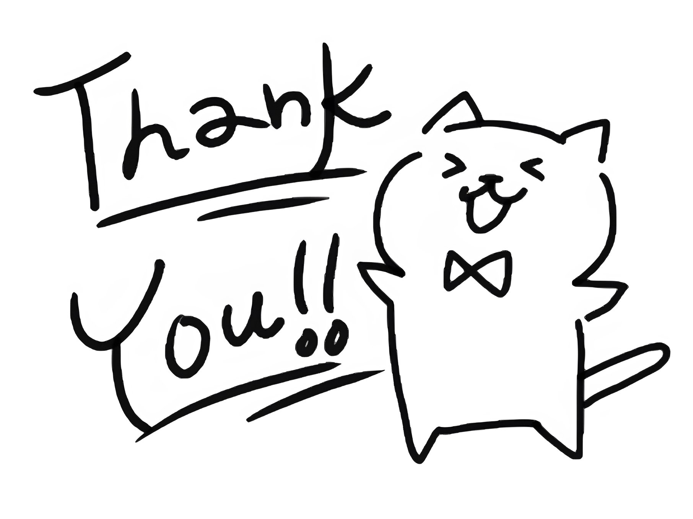

```{r setup, include=FALSE}
options(htmltools.dir.version = FALSE)
knitr::opts_chunk$set(
  fig.asp = 9/16,
  fig.align = 'center',
  echo = T,
  out.width = "95%",
  dpi= 300
)
library(ggplot2)

        
```
<style>

.center1 {
  margin: 0;
  position: absolute;
  top: 70%;
  left: 25%;
  -ms-transform: translate(-50%, -50%);
  transform: translate(-50%, -50%);
}

.center2 {
  margin: 0;
  position: absolute;
  top: 70%;
  left: 50%;
  -ms-transform: translate(-50%, -50%);
  transform: translate(-50%, -50%);
}

.center3 {
  margin: 0;
  position: absolute;
  top: 70%;
  left: 75%;
  -ms-transform: translate(-50%, -50%);
  transform: translate(-50%, -50%);
}

.center4 {
  margin: 0;
  position: absolute;
  top: 50%;
  left: 35%;
  -ms-transform: translate(-50%, -50%);
  transform: translate(-50%, -50%);
}
.center5 {
  margin: 0;
  position: absolute;
  top: 50%;
  left: 75%;
  -ms-transform: translate(-50%, -50%);
  transform: translate(-50%, -50%);
}

.center6 {
  margin: 0;
  position: absolute;
  top: 50%;
  left: 50%;
  -ms-transform: translate(-50%, -50%);
  transform: translate(-50%, -50%);
}

.center7 {
  margin: 0;
  position: absolute;
  top: 75%;
  left: 50%;
  -ms-transform: translate(-50%, -50%);
  transform: translate(-50%, -50%);
}

.gg {
  margin: 0;
  position: absolute;
  top: 60%;
  left: 50%;
  -ms-transform: translate(-50%, -50%);
  transform: translate(-50%, -50%);
}

.pull-left {
  float: left;
  width: 47%;
}
.pull-right {
  float: right;
  width: 47%;
}

</style>

<style type = "text/css">
.remark-slide-content{
  font-size: 32px;
  padding : 1em 4em 1em 4em;
} </style>


# Members
- HUMAIRA KASHMI
- NANZIBA ADNIN SINTHI
- ISHTIAQ MAHMUD FAHIM
- MD. NAZIR HOSEN
- BIPANTI CHAKMA
- MOLLA MD. NASIM
---
class: inverse, center, middle
background-image: url(abs.png)
background-size: contain

#Our Topic
---

- <b>Regular Expression</b>

- <b>`stringr`</b>

- <b>`forcats`</b>

.center1[

]
.center2[

]
.center3[

]

---

# What is Regular Expression?

- A sequence of characters that defines a search pattern 


- Enables the identification and extraction of specific patterns or sequences of characters  


- Provides a standardized and efficient way to describe and manipulate text

---

# A Simple Introduction to RegEx

.center4[

]
.center5[

]

---

# Some Basic Regex:


 `\d` : matches any `digit` <br>
 `\s` : matches any `whitespace` <br>
 `[abc]` : matches `a,b or c` <br>
 `[^abc]` : matches anything `except a,b,c` <br>

 `\w`   : matches any `word character` <br>
 `{m}`   : specifies `exactly m` occurrences <br>
 `{m,n}` : specifies a `range` of occurrences 


---

class: inverse, center, middle
background-image: url(abs.png)
background-size: contain

#Regex symphony with `stringr`


---

# Matching Patterns

```{r,message=FALSE,warning=FALSE}
library(tidyverse)
```


```{r c1}
x <- c("banana","Gray","Grey","kiwi",
       "box","169","F-16")
```


```{r}
str_view(x,"box") 
```

```{r}
str_view(x,"Gr(a|e)y")
```

---


# Replace or Extracting Patterns

```{r ref.label='c1',echo=TRUE,eval=FALSE}

```

```{r}

str_replace_all(x,"[aeiou]","_")

```

```{r}

unlist(str_extract_all(x,"\\d{2,3}"))

```

---

# Adding string together

```{r}
x <- c("apple","pie","cake")

str_c(x,collapse = " ")

```

```{r}
str_c(x,collapse = "_")
```


---

# How it works?
.center6[

]

---
# Repetition
.pull-left[
`?` : matches 0 or 1 occurrence 
<br>
<br>
`+` : matches 0 or more occurrences 
<br>
<br>
`*` :matches 1 or more occurrences 
<br>
<br>
]
.pull-right[

]

---
#An Example

Use the dataset `words` to find : <br>
- <b>`Average` no. of `vowels` per `word`?</b>

```{r}
head(words,4)

length(words)
```


---

# Average no. of vowels per word?

```{r}
dat_f <- tibble(
  word = words
)
```
<br>

# Str_count

`str_count` Counts the number of occurrences of a pattern within each string
---

# Average no. of vowels per word?
```{r c2,eval=FALSE}

dat_fn <- dat_f %>% 
  mutate(
    n = 
      str_count(words,"\\w"), 
    vowels = 
      str_count(words,"[aeiou]"), 
    consonent = 
      str_count(words,"[^aeiou]")
  ) 
head(dat_fn,3)
nrow(dat_fn)
```

---

#Average no. of vowels per word?

```{r ref.label='c2',eval=TRUE,echo=FALSE}

```

`Average :`

```{r}
mean(dat_fn$vowels)
```


---
class: inverse, center, middle
background-image: url(abs.png)
background-size: contain

# Intrigating `forcats` with `stringr`
---

# A Pathological Example

We have a dataset(hypothetical) of `80` people of Bangladesh
It includes their ;

- <b style="color:red;">Names</b>
- <b style="color:red;">Emails</b>
- <b style="color:red;">Cities </b>
- <b style="color:red;">Working experiences </b>
- <b style="color:red;">phone numbers</b>


---

# Chunk of the dataset



```{r,echo=FALSE}
untidy <- "1, Abdullah Khan, abdullah.khan23@gmail.com, Dhaka, 3 years, +8801712345678,
2, Fatima Ahmed, fatima_ahmed456@yahoo.com, Chittagong, 5 years, 01919283746,
3, Ali Rahman, ali-rahman@hotmail.com, Rajshahi, 2 years, +8801712345678,
4, Ayesha Islam, ayesha.123@gmail.com, Khulna, 4 years, 01512345678,
5, Saif Uddin, saif789@yahoo.com, Barisal, 6 years, +8801512345678,
6, Naima Begum, naima_begum_12@gmail.com, Sylhet, 1 year, 01987654321,
7, Rahman Khan, rahman_khan456@yahoo.com, Dhaka, 3 years, +8801612345678,
8, Tahira Ahmed, tahira.ahmed_89@hotmail.com, Chittagong, 5 years, 01912345678,
9, Kamal Hasan, kamal_123@gmail.com, Rajshahi, 2 years, 01987654321,
10, Saba Islam, saba_islam_456@yahoo.com, Khulna, 4 years, 01911223344,
11, Imran Uddin, imran_789@outlook.com, Barisal, 6 years, +8801712345678,
12, Rukhsar Begum, rukhsar_begum.12@gmail.com, Sylhet, 1 year, 01587654321,
13, Tariq Khan, tariq.khan_456@yahoo.com, Dhaka, 3 years, +8801612345678,
14, Farida Ahmed, farida.ahmed_789@hotmail.com, Chittagong, 5 years, 01712345678,
15, Nasir Rahman, nasir_123@gmail.com, Rajshahi, 2 years, 01787654321,
16, Saima Islam, saima.islam_456@yahoo.com, Khulna, 4 years, 01511223344,
17, Arif Uddin, arif_789@hotmail.com, Barisal, 6 years, +8801612345678,
18, Yasmin Begum, yasmin.begum_12@gmail.com, Sylhet, 1 year, 01587654321,
19, Rafiq Ahmed, rafiq_ahmed_123@gmail.com, Dhaka, 3 years, +8801512345678,
20, Aisha Khan, aisha.khan_456@yahoo.com, Chittagong, 5 years, 01712345678,
21, Rahim Hasan, rahim.hasan_789@outlook.com, Rajshahi, 2 years, 01887654321,
22, Sabina Islam, sabina.islam_123@gmail.com, Khulna, 4 years, 01811223344,
23, Noman Uddin, noman.uddin_456@yahoo.com, Barisal, 6 years, +8801812345678,
24, Shabnam Begum, shabnam.begum_789@hotmail.com, Sylhet, 1 year, 01887654321,
25, Zahid Khan, zahid.khan_123@gmail.com, Dhaka, 3 years, +8801812345678,
26, Yasmina Ahmed, yasmina.ahmed_456@yahoo.com, Chittagong, 5 years, 01512345678,
27, Iqbal Rahman, iqbal.rahman_789@hotmail.com, Rajshahi, 2 years, 01987654321,
28, Sultana Islam, sultana.islam_123@gmail.com, Khulna, 4 years, 01711223344,
29, Khaled Uddin, khaled.uddin_456@yahoo.com, Barisal, 6 years, +8801612345678,
30, Rina Begum, rina.begum_789@hotmail.com, Sylhet, 1 year, 01687654321,
31, Salim Khan, salim.khan_123@gmail.com, Dhaka, 3 years, +8801612345678,
32, Ayesha Khan, ayesha.khan_456@yahoo.com, Chittagong, 5 years, 01587654321,
33, Faisal Hasan, faisal.hasan_789@icloud.com, Rajshahi, 2 years, 01987654321,
34, Shabnam Islam, shabnam.islam_123@gmail.com, Khulna, 4 years, 01911223344,
35, Naim Uddin, naim.uddin_456@yahoo.com, Barisal, 6 years, +8801912345678,
36, Rehana Begum, rehana.begum_789@outlook.com, Sylhet, 1 year, 01787654321,
37, Kabir Khan, kabir.khan_123@gmail.com, Dhaka, 3 years, +8801912345678,
38, Amina Ahmed, amina.ahmed_456@yahoo.com, Chittagong, 5 years, 01712345678,
39, Rafiqul Hasan, rafiqul.hasan_789@hotmail.com, Rajshahi, 2 years, 01587654321,
40, Sabrina Islam, sabrina.islam_123@gmail.com, Khulna, 4 years, 01511223344,
41, Kazi Uddin, kazi.uddin_456@yahoo.com, Barisal, 6 years, +8801612345678,
42, Rima Begum, rima.begum_789@icloud.com, Sylhet, 1 year, 01787654321,
43, Imtiaz Khan, imtiaz.khan_123@gmail.com, Dhaka, 3 years, +8801912345678,
44, Yasmin Ahmed, yasmin.ahmed_456@yahoo.com, Chittagong, 5 years, 01712345678,
45, Shahid Rahman, shahid.rahman_789@hotmail.com, Rajshahi, 2 years, 01687654321,
46, Salma Islam, salma.islam_123@gmail.com, Khulna, 4 years, 01911223344,
47, Rashid Uddin, rashid.uddin_456@yahoo.com, Barisal, 6 years, +8801612345678,
48, Shahnaz Begum, shahnaz.begum_789@outlook.com, Sylhet, 1 year, 01987654321,
49, Naeem Khan, naeem.khan_123@gmail.com, Dhaka, 3 years, +8801912345678,
50, Sultana Ahmed, sultana.ahmed_456@yahoo.com, Chittagong, 5 years, 01712345678,
51, Irfan Hasan, irfan.hasan_789@hotmail.com, Rajshahi, 2 years, 01987654321,
52, Shamima Islam, shamima.islam_123@gmail.com, Khulna, 4 years, 01611223344,
53, Nasim Uddin, nasim.uddin_456@yahoo.com, Barisal, 6 years, +8801912345678,
54, Nasrin Begum, nasrin.begum_789@gmail.com, Sylhet, 1 year, 01887654321,
55, Anwar Khan, anwar.khan_123@gmail.com, Dhaka, 3 years, +8801912345678,
56, Aisha Fatima Khan, aisha.fatima.khan_789@gmail.com, Chittagong, 5 years, 01912345678,
57, Imran Rahman Uddin, imran.rahman.uddin_123@gmail.com, Rajshahi, 2 years, 01987654321,
58, Sabina Ali Islam, sabina.ali.islam_456@yahoo.com, Khulna, 4 years, 01611223344,
59, Noman Ahmed Uddin, noman.ahmed.uddin_789@yahoo.com, Barisal, 6 years, +8801612345678,
60, Shabnam Iqbal Begum, shabnam.iqbal.begum_123@yahoo.com, Sylhet, 1 year, 01787654321,
61, Zahid Rahman Khan, zahid.rahman.khan_456@gmail.com, Dhaka, 3 years, +8801712345678,
62, Yasmina Ahmed Khan, yasmina.ahmed.khan_789@yahoo.com, Chittagong, 5 years, 01912345678,
63, Iqbal Rahman Hasan, iqbal.rahman.hasan_123@icloud.com, Rajshahi, 2 years, 01787654321,
64, Sultana Islam Uddin, sultana.islam.uddin_456@gmail.com, Khulna, 4 years, 01711223344,
65, Khaled Rahman Uddin, khaled.rahman.uddin_789@yahoo.com, Barisal, 6 years, +8801912345678,
66, Rina Shabnam Begum, rina.shabnam.begum_123@hotmail.com, Sylhet, 1 year, 01787654321,
67, Salim Rahman Khan, salim.rahman.khan_456@gmail.com, Dhaka, 3 years, +8801712345678,
68, Ayesha Khan Ahmed, ayesha.khan.ahmed_789@yahoo.com, Chittagong, 5 years, 01512345678,
69, Nasir Rahman Iqbal, nasir.rahman.iqbal_123@gmail.com, Rajshahi, 2 years, 01787654321,
70, Saima Islam Rahman, saima.islam.rahman_456@yahoo.com, Khulna, 4 years, 01911223344,
71, Arif Uddin Hasan, arif.uddin.hasan_789@yahoo.com, Barisal, 6 years, +8801612345678,
72, Yasmin Begum Ali, yasmin.begum.ali_123@gmail.com, Sylhet, 1 year, 01987654321,
73, Rafiq Ahmed Khan, rafiq.ahmed.khan_789@yahoo.com, Dhaka, 3 years, +8801512345678,
74, Aisha Khan Rahman, aisha.khan.rahman_456@gmail.com, Chittagong, 5 years, 01612345678,
75, Rahim Hasan Islam, rahim.hasan.islam_123@gmail.com, Rajshahi, 2 years, 01987654321,
76, Sabina Ali Rahman, sabina.ali.rahman_789@yahoo.com, Khulna, 4 years, 01711223344,
77, Noman Ahmed Khan, noman.ahmed.khan_123@gmail.com, Barisal, 6 years, +8801512345678,
78, Shabnam Iqbal Rahman, shabnam.iqbal.rahman_456@gmail.com, Sylhet, 1 year, 01587654321,
79, Zahid Rahman Uddin, zahid.rahman.uddin_789@gmail.com, Dhaka, 3 years, +8801612345678,
80, Yasmina Ahmed Rahman, yasmina.ahmed.rahman_456@yahoo.com, Chittagong, 5 years, 01612345678"
```

---

# How can we organize it?

Firstly, Split the `messy string` into `character vector elements` <br>
<br>

Secondly,We can remove `Space` at the `begining of each string` <br>
<br>

Lastly, write `best fitted Regular Expression` for your variables of given dataset to extract them

---

# Extracting data from untidy mess

`Step 1`

Split the messy string into character vector elements

```{r}

untidy_ext <- str_split_1(untidy,",")
head(untidy_ext)

```

---

# Extracting data from untidy mess

`Step 2`

Removing Space at the begining of each string 

```{r}
untidy_ext <- str_replace_all(untidy_ext,"^\\s","")
head(untidy_ext)
```

---

# Extracting data from untidy mess

`step 3`

Writing fitted regular expression for the given dataset to extract them

<br> Name  : `^[A-Za-z]+\\s?[A-Za-z]*\\s[A-Za-z]+$`
<br> Email : `^[a-zA-Z0-9._%+-]+@[a-zA-Z]+\\.[a-zA-Z]{2,}$`
<br> Mob No: `^[+880]+\\d{10}$`
<br> Expr  : `^\\d{1,2}\\s[a-zA-Z]+$`
<br> City  : `^[a-zA-Z]+$`

---

# Cont

```{r}

Names <- str_subset(untidy_ext,"^[A-Za-z]+\\s?[A-Za-z]*\\s[A-Za-z]+$")
Emails <- str_subset(untidy_ext,"^[a-zA-Z0-9._%+-]+@[a-zA-Z]+\\.[a-zA-Z]{2,}$")
Phone <- str_subset(untidy_ext,"^[+880]+\\d{10}$")
Experience <- str_subset(untidy_ext,"^\\d{1,2}\\s[a-zA-Z]+$")
City <- str_subset(untidy_ext,"^[a-zA-Z]+$")

```

---

# Extracting data from untidy mess

Removing `+880`

```{r}
Phone_w_cc <- str_replace_all(Phone,"^[+880]*","0")

```

Removing `years`

```{r}
Experience_num <- as.numeric(
  str_replace_all(
    Experience,"[a-zA-Z]+",""))
```

---

# Making a dataframe from extracted data

```{r}
tidy_dat <- tibble(
  Names = Names,
  Emails = Emails,
  Phone = Phone_w_cc,
  Experience = Experience_num,
  City = City
)

nrow(tidy_dat)
```

---

# Cont.

```{r, eval=FALSE}
tidy_dat %>% 
  head(3)
```

```{r,echo=FALSE}
tidy_dat %>% 
  select(Names,Emails,City) %>% 
  head(3)
```
```{r,echo=FALSE}
tidy_dat %>% 
  select(Phone,Experience) %>% 
  head(3)

nrow(tidy_dat)
```

---

#Visulization of Email Providers

Extracting `@domain` :

```{r}
tidy_dat_new <- 
  tidy_dat %>%
  select(Emails) %>% 
  mutate(
    Email_provider = unlist(str_extract_all(
      Emails , "@[a-z]+"
    ))
    ) 
```

---

#Basic Visualization

```{r}
 bp <- 
 tidy_dat_new %>% 
  ggplot() +
  geom_bar(
    mapping = 
      aes(x=Email_provider,
        fill = Email_provider),
    col = "black"
  ) +
  labs(
    x = "Email Provider",
    y = "Frequency"
  ) +
  theme_minimal()

```

---

#Cont.

.gg[


```{r,echo=FALSE, r,echo=FALSE}
bp
```
]

---

# fct_lump()

`fct_lump()` lumps infrequent levels of a factor into a single "Other" category.

```{r}

lump <- tidy_dat_new %>% 
  mutate(
    Email_provider = unlist(str_extract_all(
      Emails , "@[a-zA-Z]+"
    )),
    Email_provider = fct_lump(Email_provider) 
  ) 
  
```

---

#cont

```{r}
bp2 <-
  lump %>% 
  ggplot() +
  geom_bar(
    mapping = 
      aes(x=Email_provider,
        fill = Email_provider),
    col = "black"
  ) +
  labs(
    x = "Email Provider",
    y = "Frequency"
  ) +
  theme_minimal()
```


---

```{r,echo=FALSE}
bp2
```


---

# Visulization of Mobile Operators

`fct_recode()` recodes levels of a factor variable

```{r}

tidy_dat_opr <-
tidy_dat %>% 
  mutate(
    Operator = unlist(str_extract_all(
      Phone , "^\\d{3}"
    )),
    Operator = fct_recode(
      Operator,
      Teletalk = "015",
      Airtel = "016",
      Grameen = "017",
      Robi = "018",
      Banglalink = "019"
    ) 
  )

```

---

#Cont.

```{r}
opp <-
  tidy_dat_opr %>% 
  select(Operator,City) %>% 
  ggplot() +
  geom_bar(
    aes(x= Operator,
        fill = City
    ),
    col="black"
  )+
  labs(
    x = "Operator",
    y = "Frequency"
  ) +
  theme_minimal()

```

---

# Visualization

```{r,echo=FALSE,eval=TRUE}

opp

```

---

# Visualizing Average Working Experience

`fct_reorder` reorder the levels of a factor based on the values of another variable

```{r}
wep <-
tidy_dat %>%
mutate(City = fct_reorder(City, Experience)) %>%
ggplot() +
geom_point(
  aes(Experience, 
      City,
      col = City),
  size = 3
  ) +
  labs(
    x = "Average Work Experience"
  )
  
```


---

#cont

```{r,echo=FALSE}

wep

```

---
class: inverse, center, middle
background-image: url(abs.png)
background-size: contain

#Begining Of The End

---

# Puzzles to be Solved

- Regular expressions are powerful tools for string manipulation, easy to learn hard to master
- `stringr` and `forcats` provide user-friendly interfaces for working with strings and factors in R
- Practice and experimentation are key to mastering Regular Expressions
- `Mastering Regular Expressions by Jeffrey Friedl` is a great book to start exploring!

.center7[

]


